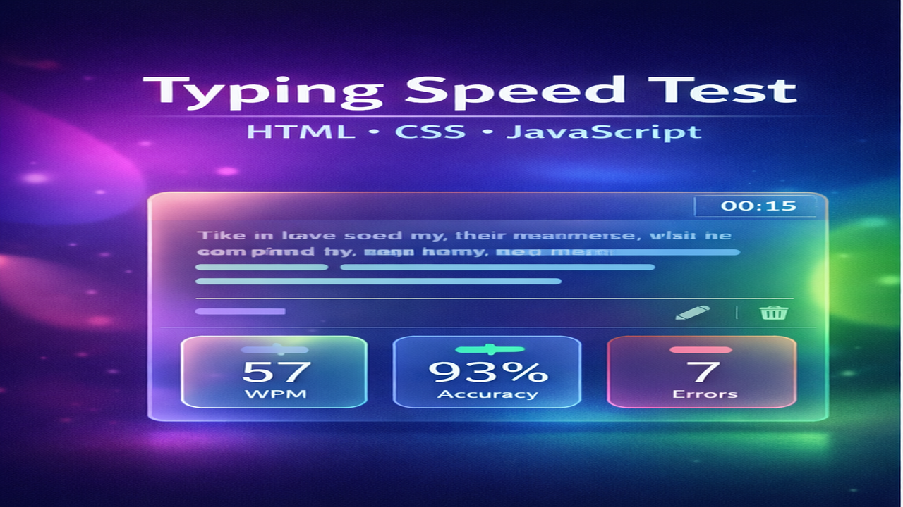
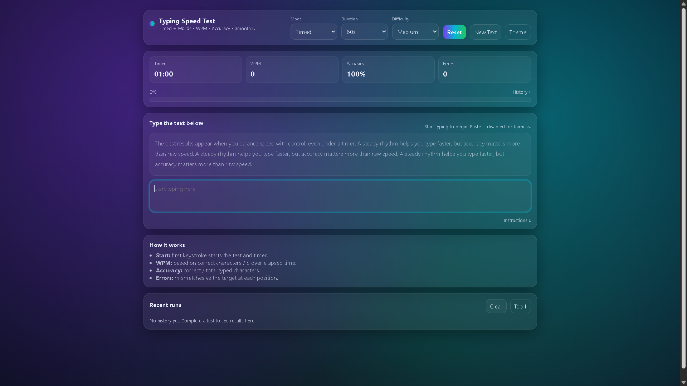
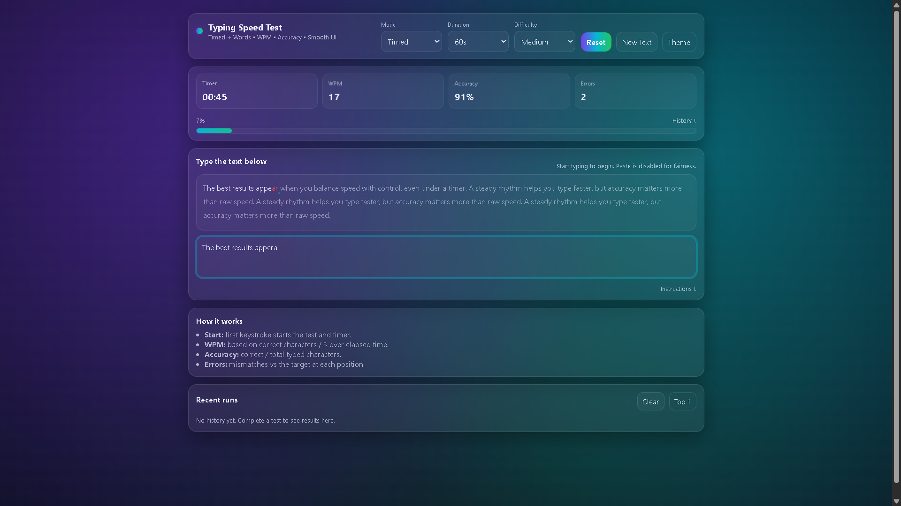

# 🚀 08 - Simple Web Projects: **Typing Speed Test** (HTML, CSS, JavaScript)

<p align="center">
  
</p>

[](LICENSE)


This is the eighth project in the **Simple Web Projects** series — a clean, fully responsive **Typing Speed Test** built with pure **HTML, CSS, and Vanilla JavaScript**.

It includes timer modes, per-character highlighting, live **WPM + Accuracy + Errors**, a smooth gradient UI, and subtle animations — **no frameworks, no build tools, no libraries**.

> ⚠️ **Disclaimer:** “Typing Speed Test” is only the project name — it is not my personal name.

------------------------------------------------------------------------

## ✨ Features

- Time modes: 15 / 30 / 60 / 120 seconds
- Timer starts on the **first keystroke**
- Random text generator (local array — no API)
- Difficulty levels: Easy / Medium / Hard
- Per-character highlighting (correct / incorrect / caret)
- Live stats: WPM (net), Accuracy %, Errors, Progress bar
- Settings modal (ESC + click outside to close)
- Dark/Light theme toggle (CSS variables)
- Smooth animations + transitions (gradient drift, caret blink, stat pop)
- Results card with smooth reveal + auto-scroll
- Fully responsive & accessible (+ prefers-reduced-motion support)

------------------------------------------------------------------------

## 📸 Screenshots


### Home / Test Screen



### Results Screen


------------------------------------------------------------------------

## 🚀 Getting Started

1. **Clone this repository**
```bash
git clone https://github.com/vishal-git-dot/08-simple-web-projects-html-css-js.git
```

2. **Navigate to the project folder**
```bash
cd typing-speed-test
```

3. **Open index.html in your browser**
```bash
# No server required
```

------------------------------------------------------------------------

## 🧠 JavaScript Concepts Used

| Concept | Description |
|------|------------|
| Arrays / Objects | Store texts by difficulty |
| DOM manipulation | Render spans per character, update UI |
| addEventListener() | Capture typing + button actions |
| Timers (setInterval) | Countdown logic |
| String comparison | Per-character correctness checks |
| Conditionals | State transitions & validation |
| Local state machine | idle → running → paused → finished |

------------------------------------------------------------------------

## 📁 File Structure

Project root: `typing-speed-test/`

```text
typing-speed-test/
├── index.html
├── styles.css
├── script.js
└── assets/
    ├── screenshot-test.png
    └── screenshot-results.png
```

------------------------------------------------------------------------

## 📚 Project Series Overview

| # | Project Name | Skills | Features |
|--|-------------|-------|----------|
| ✅ 01 | To-Do List App | DOM, localStorage | Add/edit/delete |
| ✅ 02 | Calculator | Logic, CSS Grid | Arithmetic |
| ✅ 03 | Weather App | Fetch API | City search |
| ✅ 04 | Digital Clock | Time API | Live time |
| ✅ 05 | Quiz App | Events, logic | MCQs |
| ✅ 06 | SlideX Carousel | CSS & JS | Image slider |
| ✅ 07 | Portfolio Website | Layout, responsiveness | About, Projects |
| ⭐ 08 | **Typing Speed Test** | Timers, string logic | WPM, Accuracy |
| 🔜 09 | Notes App | localStorage | Notes |
| 🔜 10 | Rock Paper Scissors | Conditionals | Game |

------------------------------------------------------------------------

## 🛠️ Built With

- HTML5
- CSS3
- JavaScript (ES6+)

------------------------------------------------------------------------

## 🤝 Contributing

Contributions are welcome!
- Fork the repo
- Improve features or UI
- Submit a pull request

If you like this project, please ⭐ star the repository.

------------------------------------------------------------------------

## 📄 License

This project is licensed under the MIT License.

------------------------------------------------------------------------

<div align="center">

Made with ❤️ as part of a self-learning series.

</div>
